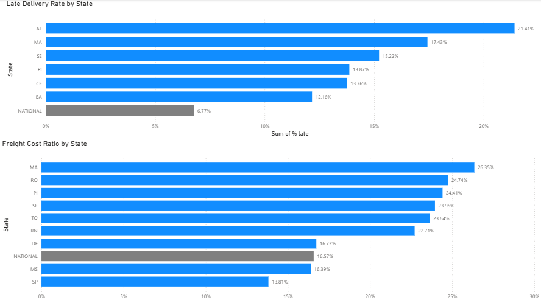

# Olist E-commerce Data Analysis
   
Data analysis project using the Olist Brazilian E-commerce Public Dataset (Kaggle), looking at where delivery and pricing issues concentrate across Brazil's states.

## Problem

Olist ships orders across all of Brazil. Two open questions: are delivery delays spread evenly across the country, and does freight cost eat into margin the same way everywhere? If either problem concentrates in specific states, that changes where logistics investment should go first.

## Approach

- Loaded orders, customers, and order items (96,478 delivered orders, 112,650 order items)
- Calculated the gap between actual and estimated delivery date per order, then grouped the late-delivery rate by customer state
- Calculated freight value as a share of item price per order item, then grouped by customer state
- Kept only states with 200+ orders/items so the rates are based on enough volume to be meaningful

Full code: [`analysis.py`](analysis.py)

## Key Findings

- **Customer Impact:** Late deliveries cut average review scores from 4.29 to 2.27 (-2.02 pts);
  the share of 1-2 star reviews jumped from 9.3% to 62.4%.
- **Geographic Hotspot:** Rio de Janeiro (RJ) had 1,495 delayed orders — 12.1% of its 12,353
  orders, the highest absolute delay volume of any state.
- **Freight Inefficiency:** Electronics shipping costs averaged 29.1% of product price
  (n=2,767 items), notably higher than most other high-volume categories.

## Business Recommendations

1. Prioritize on-time delivery as the top lever for customer satisfaction — it is the
   strongest predictor of poor reviews found in this analysis.
2. Audit shipping routes/carrier performance specifically for Rio de Janeiro given its
   outsized absolute impact on delayed orders.
3. Review packaging and freight partnerships for the electronics category to reduce its
   disproportionate shipping-cost-to-price ratio.

## Tools

Python (pandas), SQL (DuckDB), Excel, Power BI

## Files

- `analysis.py` — full analysis code
- `olist_business_findings_report.xlsx` — findings summary with verifiable Excel formulas
- `case_study_olist.md` — full case study write-up
- `olist-dashboard.pbix` — full Power BI dashboard file
